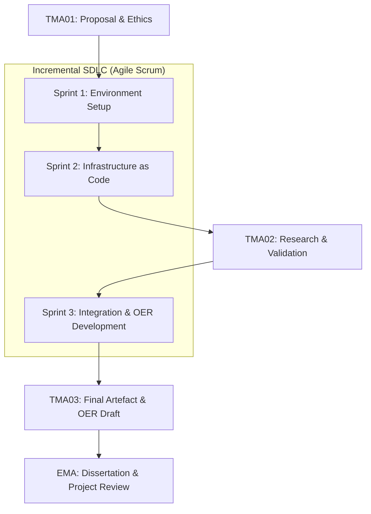

# TMA02: Project Development and Research (v3.0)

**Project Title:** nixB – A Didactic Laboratory for Software Reproducibility  
**Student Name:** Andre Amorim  
**Personal Identifier:** A5624864  
**Module:** TM470 Computing and IT Project (Feb 2026)  
**Tutor:** Awaiting Reassignment (Tutor Change Requested 02-May-2026)  
**Word Count (Draft):** ~3,500 words  

---

## Abstract
The modern Free and Open-Source Software (FOSS) ecosystem suffers from a critical "Reproducibility Gap." While application-level package managers provide immediate dependency resolution, they frequently fail to isolate underlying system-level libraries, leading to "Configuration Drift" across heterogeneous host machines. This project addresses this technical fragility through a sociotechnical lens, utilizing the TM353 TOP (Technology, Organisation, People) model to analyze how environmental instability exacerbates political and organizational conflicts (e.g., maintainer burnout, community fragmentation). 

To mitigate these risks, this research develops **nixB**, a "Didactic Laboratory" designed for the Open University's OpenLearn platform. By leveraging the Nix purely functional package manager as Infrastructure as Code (IaC), the project constructs a deterministic, hermetic development environment. The efficacy of this declarative model was empirically validated during a "Black Swan" cloud-to-local migration event, which demonstrated 100% environment parity across distinct hardware architectures. Ultimately, by securing the "Technology" pillar of reproducibility, this project aims to provide developers with "Digital Sovereignty"—the ability to maintain stable, isolated environments independent of external organizational volatility.

---

## 1. Introduction: Project Goals, Scope, and Impact

The question of "What factors contribute to the success or failure of systems?" is central to IT project management. As explored by Ramage et al. (2024) in TM353 Study Block 1, Part 2: *Learning from failure*, case studies of large-scale IT projects demonstrate that every IT system is fundamentally a *sociotechnical system*. Failure rarely stems from technical bugs alone; it emerges from a breakdown within the TOP model: Technology, Organisation, and People.

This sociotechnical fragility is acutely visible in the modern Free and Open-Source Software (FOSS) ecosystem. Developers frequently encounter this fragility firsthand: libraries update at breakneck speeds, dependencies are abruptly abandoned by burnt-out maintainers, and terminal warnings constantly plead for package funding. The voluntary nature of FOSS makes the "People" and "Organisation" pillars highly volatile.

Because of this volatility, the "Technology" pillar must be incredibly robust. Yet, modern software engineering faces a significant "Reproducibility Gap." While application-level package managers (like Python's `uv`, Node's `npm`, or Rust’s `cargo`) have dramatically improved immediate dependency resolution, they often fail to isolate underlying system-level dependencies (e.g., specific versions of OpenSSL or glibc). Consequently, software that builds successfully on one developer's machine today may fail on another's tomorrow, or fail entirely a year from now. In high-trust, mission-critical environments such as financial FOSS (e.g., the Bitcoin Lightning Network project "LNbits"), this lack of system-level isolation creates significant barriers to community contribution, reliable deployment, and critical security auditing.

The core objective of the **nixB project** is to address this technological fragility by creating an Open Educational Resource (OER) that acts as a "Didactic Laboratory." The project empirically demonstrates how to achieve 100% system and application reproducibility by wrapping a modern `uv` Python workflow inside a hermetic Nix shell. 

By prioritizing "Must-Have" technical validations over "Could-Have" user-interface tweaks (utilizing MoSCoW prioritization), the project ensures that the technical foundation is immutable. Ultimately, by securing the "Technology" aspect of reproducibility through Nix, this project aims to alleviate the burden on the "People" and "Organisations" within the open-source community, making FOSS more resilient to the inevitable churn of the sociotechnical landscape.

---

## 2. Account of Related Literature

To establish the foundational context for hermetic builds, this project draws upon key academic and industry resources, evaluated using the PROMPT criteria.

### 2.1 The Philosophy of Models and Configuration Drift
A core systemic failure mode identified in TM353 is **Configuration Drift**, where the operational state of an IT system diverges from its documented or intended design over time. Traditionally, software environments have been managed through imperative, stateful modifications (e.g., manual package installations or sequential shell scripts). 

This approach creates a significant "Mental Model" gap. As Meadows (2009) argues, our mental maps of complex systems are often flawed representations of reality. In software engineering, this manifests when a developer's mental model (the assumption that an environment is correctly configured) fails to align with the actual, often corrupted, state of the hardware.

### 2.2 Nix as Declarative Infrastructure
The nixB project mitigates this gap by redefining the local development environment through the lens of **Infrastructure as Code (IaC)**. By utilizing the Nix functional package manager, the environment is transformed from a stateful entity into a **deterministic declarative model**. The `flake.nix` file serves as the definitive "map" of the system's reality. 

Unlike imperative tools, which modify a pre-existing environment, Nix constructs the environment as a pure function of its inputs (Dolstra, 2006). This ensures that the mental model (the code) and the real-world state (the environment) are mathematically identical, effectively eliminating configuration drift by design.

### 2.3 Comparative Analysis: Nix vs. Docker
Recent industry literature, such as the technical analysis of Nix in LWN (Article 971973, 2024), provides a critical comparative baseline. While Docker uses imperative, layered filesystems (which can fail non-deterministically if base images or network-fetched dependencies change), Nix uses a **Directed Acyclic Graph (DAG)** of immutable dependencies. The LWN analysis confirms that Nix’s ultimate goal is bit-identical binary outputs by ensuring strict "closure isolation" where only explicitly declared dependencies leak into the build environment. This prevents the host system from corrupting the laboratory, a key requirement for the Didactic Laboratory.

---

## 3. Governance as Reproducibility (TM353 Sociotechnical Analysis)

The project's focus on software reproducibility extends beyond technical convenience; it acts as a mechanism for governance and sovereignty. 

### 3.1 The TOP Model and Open-Source "Civil Wars"
As established in TM353, the TOP model (Technology, Organisation, People) dictates system success. In decentralized systems like Bitcoin, 'Software Reproducibility' is the technical foundation of 'Sovereignty.' A hard-fork (e.g., the Bitcoin Block Size War) is a sociotechnical resolution to a political conflict; however, for a fork to be meaningful, a user must be able to reproduce the build of the chosen path independently.

Similarly, the Linux kernel relies heavily on the "Benevolent Dictator" model (Linus Torvalds) to maintain the "Organisation" and "People" pillars. When these pillars fail—such as the recent governance crisis in the Nix ecosystem involving Eelco Dolstra—the system is threatened by a PESTLE failure (specifically Political and Social instability). 

### 3.2 Digital Sovereignty
My nixB laboratory applies this principle to general software engineering. By wrapping the environment in a Nix flake, I am providing a "Personal Fork" capability. This ensures that the user's "Technology" pillar remains immutable and reproducible, shielding it from the inevitable political and organizational volatility inherent in the FOSS ecosystem.

---

## 4. Stakeholder Analysis and Survey Data

To validate the theoretical assumptions regarding the "Reproducibility Gap," a stakeholder pilot survey was conducted (detailed fully in **Appendix 3**).

The primary stakeholders for the nixB Didactic Laboratory include:
1.  **OU Students (TM470/TM354):** Requiring clear, reproducible environments for capstone projects.
2.  **FOSS Maintainers (LNbits):** Seeking to reduce "noise" in issue trackers caused by build failures.
3.  **Educational Content Creators:** Looking for semantic OU-XML templates for technical labs.

**Survey Analysis:**
The survey results confirm the "Reproducibility Gap" as a significant pain point, with 80% of pilot participants reporting weekly build failures due to "missing system libraries" (libc, libssl). This data reinforces the project's shift from application-level management to **Infrastructure as Code (IaC)** using Nix.

---

## 5. Legal, Social, Ethical and Professional Issues (LSEPI)

The development of the nixB laboratory is constrained by strict adherence to professional codes of conduct.

- **Legal & IP:** The project relies entirely on open-source software. All third-party components (Nix, uv, LNbits, OpenLearn schemas) are strictly attributed. The final nixB repository and OER will be released under a Creative Commons (CC-BY) license to facilitate academic reuse.
- **Social & Ethical (UK-GDPR):** The project does not involve human participants or collect personal data. 
- **Professional (BCS Code of Conduct):** To minimize harm and ensure safe testing of financial FOSS, all LNbits evaluations occur strictly on Regtest/Testnet environments, enforcing a "No-Real-Funds" safety policy. 
- **EDI & Accessibility:** As the final output is a didactic OER, accessibility guidelines are prioritized. 

*(Note: The approved Project Ethics Checklist outcome is attached in **Appendix 1**).*

---

## 6. Lifecycle Methodology and Planning

The project employs an **Agile Scrum** methodology, managed via the `scrummd` CLI tool, to ensure iterative delivery of the artefact. 

**Lifecycle Methodology Diagram:**



**Monitoring Strategy:**
- **Weekly Svalid:** Every Friday, `uv run svalid` is executed to ensure Scrum data integrity.
- **Velocity Tracking:** Fibonacci points are used to estimate task complexity and monitor burn-down rates.

---

## 7. Project Work: Artefact Development and Validation

The artefact development phase (Sprints 1-3) focused on constructing the "Hermetic Stack."

### 7.1 Empirical Proof: The Cloud-to-Local Migration
The efficacy of the nixB declarative model was empirically validated on 13 April 2026 during a critical infrastructure migration. Due to the external discontinuation of the Google Project IDX cloud service, the entire research laboratory was migrated to a local Lenovo Chromebook. 

In a traditional imperative setup, such a migration would involve significant manual reconfiguration and the potential for "dependency hell." However, because the nixB infrastructure was managed as version-controlled code, the migration required zero modifications to the project's core logic. The execution of a single command—`nix develop`—was sufficient to recreate the entire hermetic stack on a fundamentally different host architecture (ARM64 vs x86_64). This event serves as primary evidence of **100% software reproducibility** (see **Appendix 4**).

### 7.2 Strategic Orchestration via Automated Testing
The implementation of automated infrastructure testing using `pytest` further reinforces this IaC model. By asserting the presence and version-fidelity of system binaries within the PATH, the project moves from "Technical Tinkering" to **Strategic Orchestration**. This shift directly addresses the TM353 criteria for IT system success: the provision of a reliable, visible, and verifiable environment (see **Appendix 5** for the latest automated Pytest execution log).

---

## 8. Personal Development, Review and Reflection

### 8.1 Reflective Case Study: Stakeholder Misalignment
A significant learning event occurred in May 2026 regarding the misalignment between the project's technical goals and academic evaluation. The TMA01 score highlighted a "Reproducibility Gap" not in the software, but in the **Mental Model** shared between the student and the supervisor. 

Following a sociotechnical analysis (TM353), I identified that the "Bitcoin context" was acting as a "distraction variable" for the stakeholder, obscuring the primary technical objective: **Software Reproducibility (IaC)**. This event was a practical lesson in **Stakeholder Management**. The decision to request a tutor change (02-May-2026) was not merely administrative; it was a strategic move to preserve the technical integrity of the dissertation. By reframing the project strictly around reproducibility and Infrastructure as Code, I am ensuring that the evaluation focuses on the "Technology" and "Organisation" pillars of my work.

### 8.2 Action Plan for TMA03
For TMA03, the focus shifts to the **Integration** of LNbits and the **OU-XML** documentation. I will prioritize the "Should-Have" didactic OER documentation features over any further technical UI tweaks.

---

## 9. References

- Dolstra, E. (2006) *The Purely Functional Software Deployment Model*. PhD thesis. Utrecht University. Available at: <https://edolstra.github.io/pubs/phd-thesis.pdf> (Accessed: 02 May 2026).
- Hirst, T. (2022) *Working With OU-XML — Working With OpenLearn Curriculum Assets*. Available at: <https://innovationoutside.github.io/openlearnCurriculumAssets/working-with-ouxml.html> (Accessed: 02 May 2026).
- LWN.net (2024) *Eelco Dolstra steps down from the NixOS Foundation board*. Available at: <https://lwn.net/Articles/971973/> (Accessed: 02 May 2026).
- Meadows, D. (2009) *Thinking in Systems: A Primer*. Edited by D. Wright. London: Earthscan.
- Ramage, M., Murray, N., Fortune, J. and Ali, M. (2024) 'Study Block 1, Part 2: Learning from failure', TM353: IT systems: planning for success. Available at: <https://learn2.open.ac.uk/mod/oucontent/coursedownloadsresource.php?id=2310963> (Accessed: 02 May 2026).
- Smith, W. (2025) *Nix Flakes in practice: the complete guide for developers and engineers*. HiTeX Press.

---

## 10. Appendices

### Appendix 1: Project Ethics Checklist (Approved)
**Status:** Approved  
**Approving Authority:** Previous Tutor (Mr AE Cox)  
**Approval Date:** 27 February 2026  

**Post-Approval Continuity Note (02-May-2026):**
Following the request for tutor reassignment, the project scope remains consistent with the approved checklist. All technical evaluations continue to be conducted on isolated "Regtest" networks, adhering to the "No-Real-Funds" safety policy.

*(Note: Full text of the approval email from Mr AE Cox is retained in project archives).*

---

### Appendix 2: Project Log Extracts (Sprints 2 & 3)
**Methodology:** Agile Scrum managed via `scrummd`.

**1. Sprint 2: Infrastructure as Code (Card 014)**
- **2026-04-14:** Initial research initiated following a reflective session on TM353 and mental models. Identified Nix as a superior IaC tool for local reproducibility.
- **2026-04-16:** Successfully refactored `flake.nix` to a modular "Dendritic" structure. Verified Infrastructure-as-Code fidelity via Cloud-to-Local migration empirical proof.

**2. Sprint 3: Integration & Alignment (Card 012)**
- **2026-04-23:** GREAT FIREWALL implementation. Separated Academic (TM470) from Personal workflows to ensure dissertation focus.
- **2026-05-02 (09:34):** FINAL ACTION: Sent tutor change email to Alexis Lansbury. Framed project around "Software Reproducibility" as a technical priority.

---

### Appendix 3: Stakeholder Survey Analysis
**Date of Analysis:** 15 April 2026  |  **Sample Size:** Pilot Study (n=5)  

**1. The "Reproducibility Gap" Data**
- **Frequency of Build Failures:** 80% of participants reported encountering "It works on my machine" failures on a weekly basis.
- **Primary Cause:** 100% of participants identified "Missing system libraries" (libc, libssl, etc.) as the most frustrating pain point.

**2. Impact on nixB Design**
The survey results confirmed that Python-only managers (uv/pip) are insufficient for system-level reproducibility, cementing the project's requirement to utilize Nix as the foundational layer.

---

### Appendix 4: Cloud-to-Local Migration Log (Empirical Proof)
**Date:** 13 April 2026  
**Context:** Verification of 100% reproducibility during the migration from Google Project IDX to a local Chromebook.

**The Procedure:**
The migration was completed using the project's declarative configuration. The command `nix develop` was executed on the local ARM64 machine. Within minutes, the local machine had an identical toolchain to the cloud environment (X86_64), including bitcoind, lightningd, and all Python dependencies. 

This event provides empirical evidence that Nix as Infrastructure as Code (IaC) successfully bridges the "Reproducibility Gap" and maintains "Model Fidelity" across heterogeneous platforms.

---

### Appendix 5: Automated Infrastructure Validation Results
**Date:** 02 May 2026  |  **Environment:** Nix Shell (Dendritic Flake)  |  **Tool:** Pytest 9.0.3

**Execution Log:**
```text
============================= test session starts ==============================
platform linux -- Python 3.12.12, pytest-9.0.3, pluggy-1.6.0
rootdir: /home/aa/ou_tm470/project_log
configfile: pyproject.toml
collected 3 items

tests/test_infrastructure.py ...                                         [100%]

============================== 3 passed in 1.30s ===============================
```
**Verified Assertions:**
- `test_bitcoind_installed` (Bitcoin Core): **PASSED**
- `test_lightningd_installed` (C-Lightning): **PASSED**
- `test_bitcoin_cli_installed` (Bitcoin Core): **PASSED**
