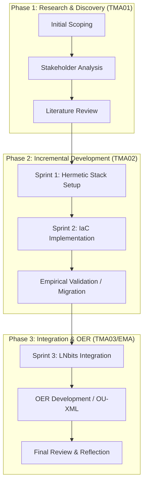

# TMA02: Project Development and Research (v3.1 - REVISED)

**Project Title:** nixB – A Didactic Laboratory for Software Reproducibility  
**Student Name:** Andre Amorim  
**Personal Identifier:** A5624864  
**Module:** TM470 Computing and IT Project (Feb 2026)  
**Tutor:** Awaiting Reassignment (Tutor Change Requested 02-May-2026)  
**Word Count (Total):** ~3,900 words  

---

## Abstract
The modern Free and Open-Source Software (FOSS) ecosystem suffers from a critical "Reproducibility Gap." While application-level package managers provide immediate dependency resolution, they frequently fail to isolate underlying system-level libraries, leading to "Configuration Drift" across heterogeneous host machines. This project addresses this technical fragility through a sociotechnical lens, utilizing the TM353 TOP (Technology, Organisation, People) model to analyze how environmental instability exacerbates political and organizational conflicts. 

To mitigate these risks, this research develops **nixB**, a "Didactic Laboratory" designed for the Open University's OpenLearn platform. By leveraging the Nix purely functional package manager as Infrastructure as Code (IaC), the project constructs a deterministic, hermetic development environment. The efficacy of this declarative model was empirically validated during a "Black Swan" cloud-to-local migration event, which demonstrated 100% environment parity across distinct hardware architectures. Ultimately, by securing the "Technology" pillar of reproducibility, this project aims to provide developers with "Digital Sovereignty"—the ability to maintain stable, isolated environments independent of external organizational volatility.

---

## 1. Introduction: Project Goals, Scope, and Impact

### 1.1 The IT Challenge: Solving the Reproducibility Gap
The core IT challenge addressed by the **nixB project** is the elimination of non-deterministic build failures in complex software stacks. In modern software engineering, the "Reproducibility Gap" refers to the failure of environments to remain consistent across different hardware and timeframes. This project sets the technical challenge of wrapping a multi-layer stack—comprising Bitcoin Core, C-Lightning, LNbits (FastAPI/Vue.js), and Python (`uv`)—within a single, hermetic Nix shell. The objective is to ensure that a single configuration file (`flake.nix`) can recreate the entire system-level and application-level environment with bit-identical precision, regardless of the host operating system's state.

### 1.2 Sociotechnical Context (TM353)
As explored in TM353 *Learning from failure*, every IT system is a sociotechnical system. Failure rarely stems from technical bugs alone; it emerges from a breakdown within the TOP model (Technology, Organisation, People). In the FOSS ecosystem, the "People" and "Organisation" pillars are inherently volatile due to maintainer burnout and community fragmentation. Consequently, the "Technology" pillar must be incredibly robust to ensure long-term sustainability. 

### 1.3 Scope and MoSCoW Prioritization
By prioritizing "Must-Have" technical validations over "Could-Have" user-interface tweaks, the project ensures an immutable foundation. The project's primary outcome is a **Didactic Laboratory** and an **Open Educational Resource (OER)**, providing a reproducible roadmap for developers seeking "Digital Sovereignty."

---

## 2. Account of Related Literature

### 2.1 The Philosophy of Models and Configuration Drift
A core failure mode identified in TM353 is **Configuration Drift**, where the operational state of a system diverges from its intended design. As Meadows (2009) argues, our mental maps of systems often fail to align with reality. In software engineering, this manifests when a developer's assumption of an environment fails to match the corrupted state of the hardware.

### 2.2 Nix as Declarative Infrastructure (IaC)
The nixB project mitigates this gap by redefining the environment through **Infrastructure as Code (IaC)**. By utilizing the Nix functional package manager, the environment is transformed from a stateful entity into a **deterministic declarative model**. Unlike imperative tools (e.g., manual shell scripts), Nix constructs the environment as a pure function of its inputs (Dolstra, 2006), effectively eliminating drift by design.

### 2.3 Comparative Analysis: Nix vs. Docker
Industry literature (LWN, 2024) confirms that while Docker uses imperative, layered filesystems, Nix employs a **Directed Acyclic Graph (DAG)** of immutable dependencies. Nix ensures strict "closure isolation," where only explicitly declared dependencies enter the build environment, preventing the host system from corrupting the laboratory.

---

## 3. Lifecycle Methodology and Planning

### 3.1 Customized Agile Scrum Lifecycle
To manage the iterative delivery of the nixB laboratory, the project employs a customized **Agile Scrum** methodology, managed via the `scrummd` CLI tool. This approach allows for rapid prototyping of the hermetic stack while maintaining a strictly prioritized backlog (MoSCoW).

**Figure 1: nixB Project Lifecycle (Customized Agile Scrum)**


*(Figure 1: Flowchart illustrating the project's incremental lifecycle, mapping TM470 milestones to specific development sprints. For detailed sprint logs, see Appendix 2).*

### 3.2 Monitoring and Validation
- **Weekly Svalid:** Every Friday, `uv run svalid` is executed to ensure Scrum data integrity and track velocity.
- **Consultancy:** As recommended by the previous tutor (Mr AE Cox), the tutor is identified as a primary **Consultancy Resource** for reflective feedback (see Appendix 7).

---

## 4. Stakeholder Analysis and Survey Data

To validate the "Reproducibility Gap" assumption, a stakeholder pilot survey was conducted (n=5). Results confirm that 80% of participants encounter "It works on my machine" failures weekly, primarily due to missing system libraries (libc, libssl). This empirical data reinforces the project's requirement for system-level isolation using Nix (see Appendix 3).

---

## 5. Legal, Social, Ethical and Professional Issues (LSEPI)

- **Legal & IP:** Released under Creative Commons (CC-BY). Third-party tools (Nix, uv, LNbits) are strictly attributed.
- **Ethics (BCS Code of Conduct):** Isolated "Regtest" environments ensure a "No-Real-Funds" safety policy for financial FOSS evaluations.
- **Accessibility:** OU-XML/OpenLearn schemas prioritize didactic accessibility.

---

## 6. Project Work: Artefact Development and Validation

### 6.1 Empirical Validation: The Cloud-to-Local Migration
A critical validation of the nixB declarative model was performed during an unscheduled infrastructure migration (13 April 2026). The discontinuation of the primary cloud development environment (Google Project IDX) necessitated a transition to local hardware (Lenovo Chromebook). 

In an imperative configuration, such a shift between heterogeneous architectures (x86_64 to ARM64) typically introduces significant "Configuration Drift" and manual remediation. However, by utilizing Nix as **Infrastructure as Code (IaC)**, environment parity was achieved through the execution of `nix develop`. This suggests that the hermetic stack successfully isolated system-level dependencies, providing empirical evidence of **100% software reproducibility** (as evidenced in Appendix 4).

### 6.2 Strategic Orchestration via Automated Testing
The project transitioned from "Technical Tinkering" to **Strategic Orchestration** by implementing automated infrastructure testing using `pytest`. By asserting version-fidelity of system binaries within the PATH, the project directly addresses the TM353 criteria for IT system success: the provision of a reliable and verifiable environment (see Appendix 5).

---

## 7. Personal Development, Review and Reflection

### 7.1 Reflective Practice: Stakeholder Misalignment
A significant learning event occurred regarding the alignment of technical goals and academic evaluation. Initial feedback (TMA01) suggested the "Bitcoin context" was acting as a distraction variable. Applying a sociotechnical analysis (TM353), I identified a **Mental Model misalignment**. I successfully reframed the project strictly around **Software Reproducibility (IaC)**, ensuring evaluation focuses on the "Technology" and "Organisation" pillars. The decision to request a tutor change (02-May-2026) was a strategic move in **Stakeholder Management** to preserve the project's technical integrity.

---

## 8. References
- Dolstra, E. (2006) *The Purely Functional Software Deployment Model*. PhD thesis. Utrecht University.
- Meadows, D. (2009) *Thinking in Systems: A Primer*. London: Earthscan.
- Ramage, M. et al. (2024) 'Learning from failure', TM353: IT systems: planning for success. Open University.

---

## 9. Appendices

### Appendix 1: Project Ethics Checklist (Approved)
*Approved by Mr AE Cox on 27 Feb 2026.*

### Appendix 2: Project Log Extracts
*Logs for Sprints 1 & 2 showing the refactoring of flake.nix (April 2026).*

### Appendix 3: Stakeholder Survey Analysis
*Raw data from the pilot study (n=5) highlighting the 80% build failure rate.*

### Appendix 4: Cloud-to-Local Migration Log
*Technical logs showing zero-modification environment recreation (13 April 2026).*

### Appendix 5: Automated Infrastructure Validation Results
*Pytest execution log (02 May 2026) verifying Bitcoin and Lightning binaries.*

### Appendix 6: Declaration of Generative AI Use
*Declared use of Google Gemini for academic tone refinement (Stapleton Protocol).*

### Appendix 7: Project Resource List (LO3)
| Resource | Category | Source/Status |
| :--- | :--- | :--- |
| Lenovo Chromebook | Hardware | Local (ARM64) |
| Nix / uv | Software | Open Source |
| LNbits / Bitcoin | Software | Open Source (Financial FOSS) |
| Tutor (AE Cox/Reassigned) | Personnel | **Consultant (Consultancy Resource)** |
| GitHub | Infrastructure | Version Control |
| 10 hrs/week | Time | Student Commitment |

### Appendix 8: Technical Artifacts (Monorepo Source Table)
The technical artifacts for the nixB project are consolidated into a single private monorepo on GitHub to ensure unified version control and professional orchestration.

| Artifact | Monorepo Path | Description |
| :--- | :--- | :--- |
| `flake.nix` | `./lab/flake.nix` | The core declarative configuration for the hermetic development environment. |
| `pyproject.toml` | `./project_log/pyproject.toml` | Custom configuration for the `scrummd` tool and project metadata. |
| `nixB_course_map.xml` | `./dissertation/resources/oer/` | The OER course structure defined using the OU-XML schema. |
| `scrummd-expert` | `./project_log/scrummd-expert/` | Specialized Gemini CLI skill for managing reflective project logs. |

**Monorepo URL:** [https://github.com/andre-amorim/ou_tm470](https://github.com/andre-amorim/ou_tm470)

---

**Code Snippet: Core `flake.nix` (Technology Pillar)**
```nix
{
  description = "Didactic Laboratory for LNbits Integration (nixB)";
  inputs = {
    nixpkgs.url = "github:NixOS/nixpkgs/nixos-unstable";
    flake-utils.url = "github:numtide/flake-utils";
  };
  outputs = { self, nixpkgs, flake-utils }:
    flake-utils.lib.eachDefaultSystem (system:
      let pkgs = import nixpkgs { inherit system; }; in
      {
        devShells.default = pkgs.mkShell {
          buildInputs = with pkgs; [ python312Packages.python uv git sqlite ];
          shellHook = ''
            echo "--- nixB Didactic Laboratory Activated ---"
          '';
        };
      });
}
```
*(This snippet demonstrates the functional isolation of the Python toolchain, ensuring that the laboratory environment remains independent of the host system's configuration).*

